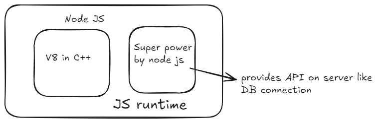

# JS On Server

## V8

- V8 written in c++ [ref](https://github.com/v8/v8) and [dev](https://v8.dev/)
- So JS Engine written in c++
- V8 can embedded into any c++
- JS -> V8(c++) -> Machine code
- So Node js is also in c++.

## ECMA Script

- is standard or rule for scripting language including Javascript
- JS engine follows ECMAScript standard
- JS ENGINE for different browser are, V8 => Google Chrome, Spider Monkey => FireFox, Chakra => Microsoft edge etc.
- V8 can't go outside ECMA Standards

## Computer

- Computer understands binary code
- So JS Engine code converts JS => C++(High level language) => machine code => assembly => binary code
- machine code , assembly are low level language
