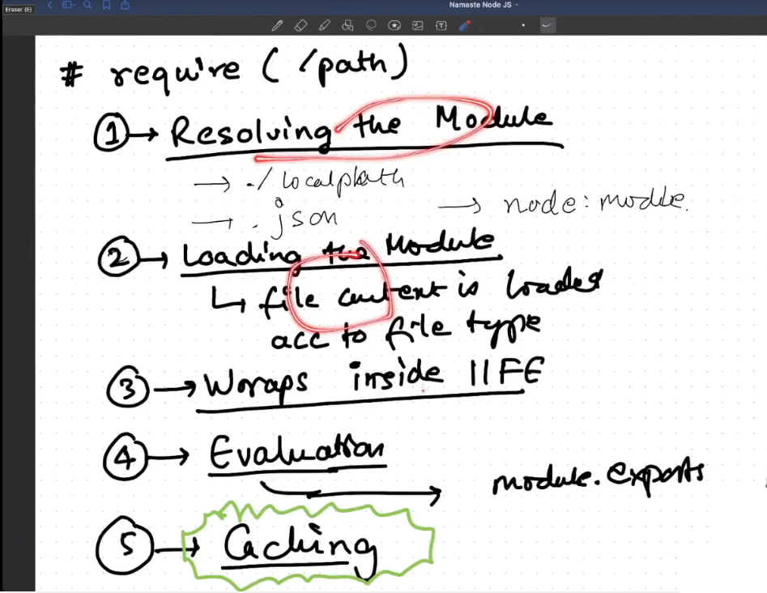

# Deep dive into Node JS github repo.

- All codes in module wrapped in function, so it scoped to that function. We Can't access them
- Node JS wrap code in IIFE i.e Immediately Invoked Function Expression before giving it to V8. It keep privacy means variable and function are safe
- `How are variable and function private in different module` => due to IIFE & require (wrapping code)
- `how do you get access to module.exports` =? IIFE has **_module_** & **_require_** parameter which is given by Node JS

```js
(function (module, require) {
  require("");
  // code
  module.exports = {};
})();
```

- IIFE works
  
- 5th => Node caches all requires and return from cache instead of iife again

- References

1. [SetTimeout](https://github.com/nodejs/node/blob/main/lib/timers/promises.js)
2. [V8](https://github.com/nodejs/node/tree/main/deps/v8)
3. [uv](https://github.com/nodejs/node/tree/main/deps/uv)
