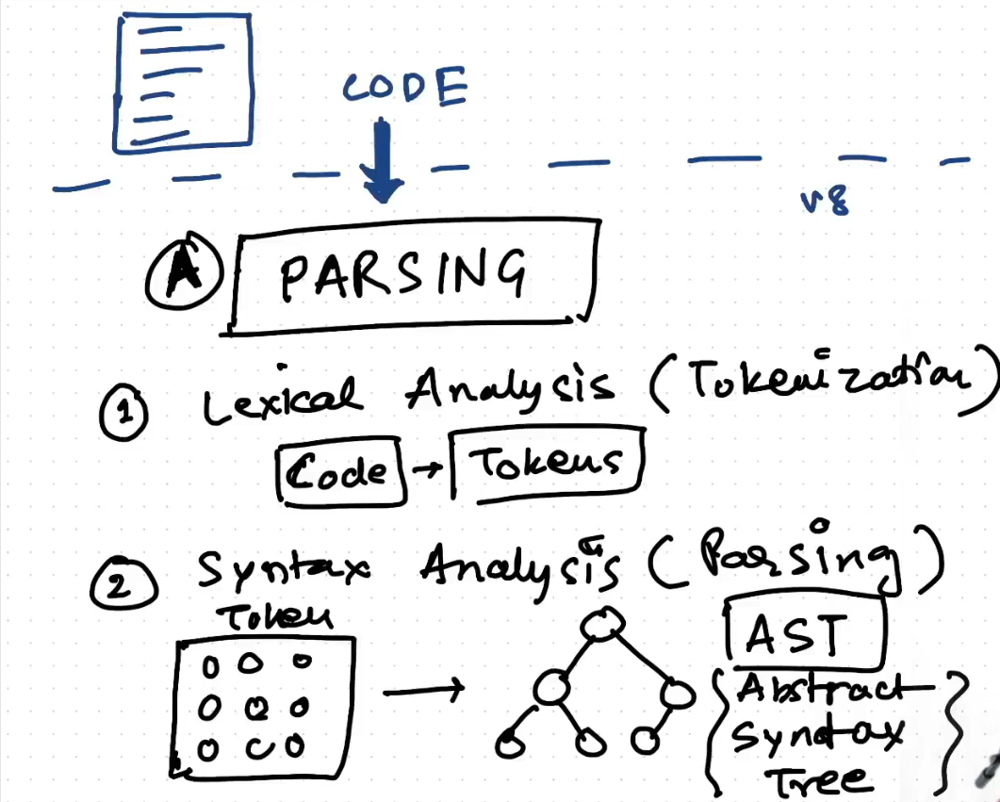
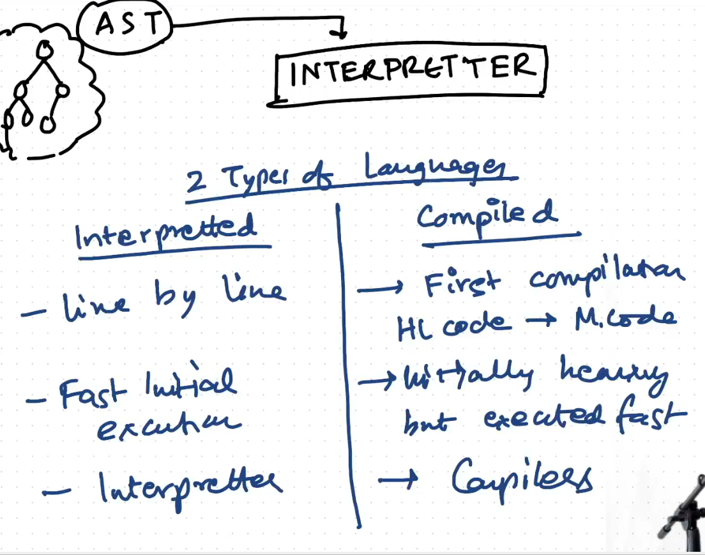

# Deep dive into v8 JS engine

## Code parsing

- [AST](https://astexplorer.net/)
- [AST Example](../js/01-08-Deep-dive-into-v8-JS-engine/ast.json)
- 

  > Follow above diagram to check code parsing in compilation

- **Syntax error** When your code can't generate AST then it throws syntax error

> **Just-in-Time Compilation/Compiler (JIT)** -> Javascript has both compiler and and interpreter

- V8 has Ignition Interpreter AST => byteCode => Execution
- Turbofan complier works behind scene
- Hot Code -> Turbofan complier -> optimized -> machine code (may be for repeated code)
- eg sum(10,5) need complier, sum(20,10) fast execution , sum(20,15) fast execution but sum("a","B") optimize fails -> Ignition Interpreter again interpret code (for optimization)

## reference

- [Just-in-time compilation](https://en.wikipedia.org/wiki/Just-in-time_compilation)
- [Ignition and Turbofan](https://v8.dev/blog/launching-ignition-and-turbofan)
- [V8 compiler](https://github.com/v8/v8/tree/main/src/compiler)
