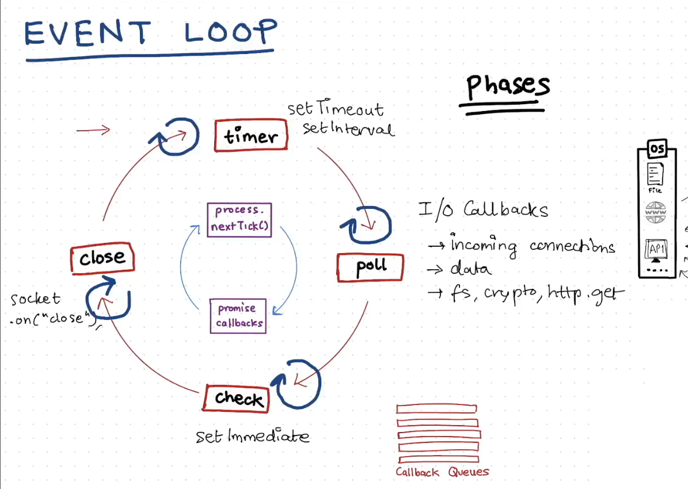
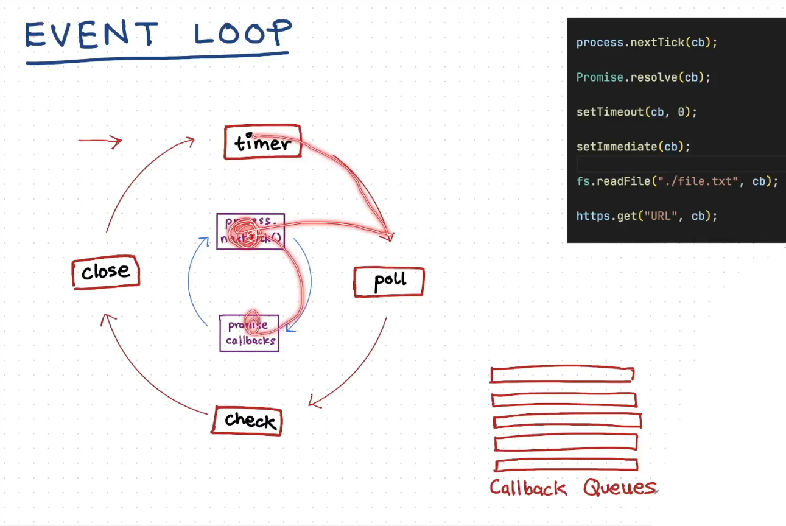

# Libuv event Loop

## Libuv Components

1. Event Loop
2. Callback Queue
3. Thread Pool

- Asynchronous I/O (Non Blocking I/O) onl;y done by Libuv

> Libuv async task returns response but if V8 (main thread) is not free or busy then this task kept in Callback Queue of Libuv. After V8 CallStack become free or ideal then task push in CallStack of V8 from Callback Queue of Libuv

> Event Loop of Libuv always keep checking that CallStack of V8 & done above steps. Event Loop moves Callback queue to CallStack in correct time and correct order

## Event Loop

- 4 phases

1. Timer(setTimeOut and SetInterval)
2. Poll (I/O Callback)
3. setImmediate
4. Close (Cleanup, socket close)

> Keep checking for V8 CallStack, and for respective phase particular callback task executed

> before every Phase EV follows process.nextTick and promise Callback then go inside phase

- All phase in callBack queue only when call-stack is free

## Check all example

## Other

> Event Loop in browser and Node JS different frome eachother

> **Semi-infinite loop** IF EL is Ideal then it waits at poll phase
