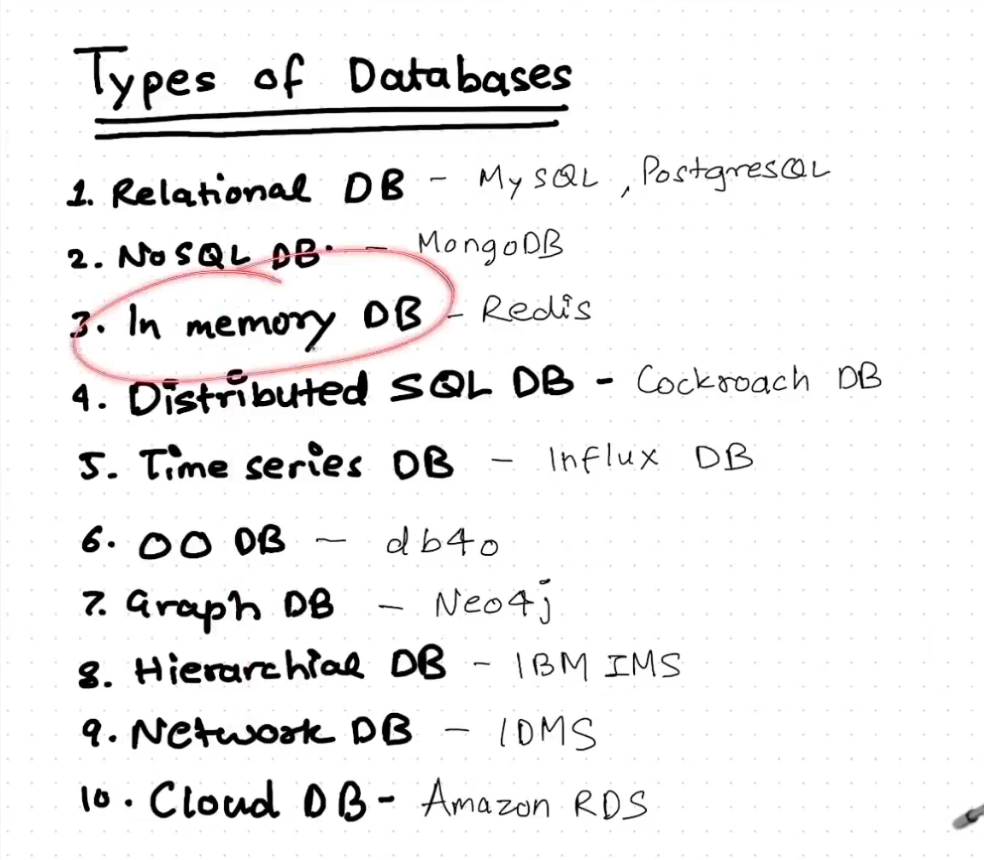
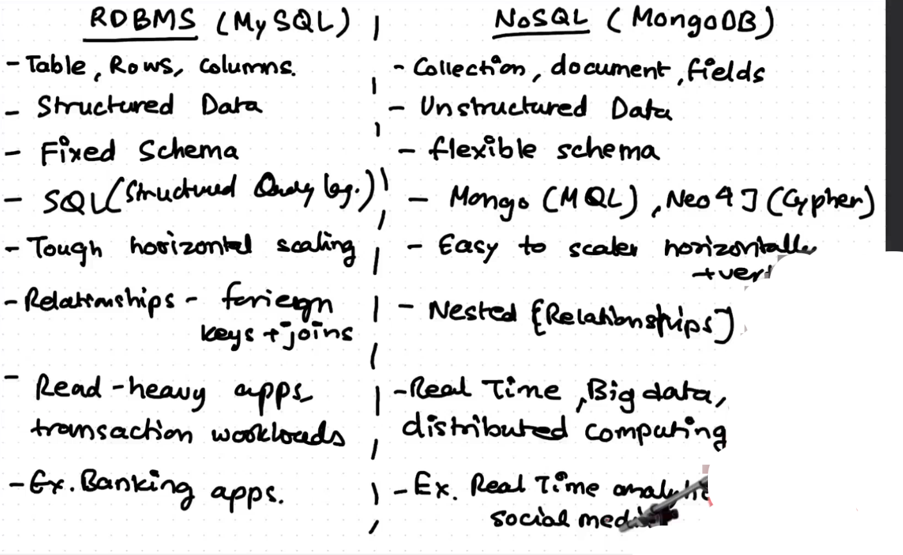

# Database SQL NoSQL

# DB

- Database is organized collection of data
- DBMS is software that interact with end users, application & db itself to capture and analyze data

## Mongo DB

- Horizontal and vertical scale up
- flexible
- compatible with js
- document <=> JSON
- developer productivity
- no need of joins
- no need for data normalization
- collection-document-field

> List of database

> Difference between SQL and No SQL
