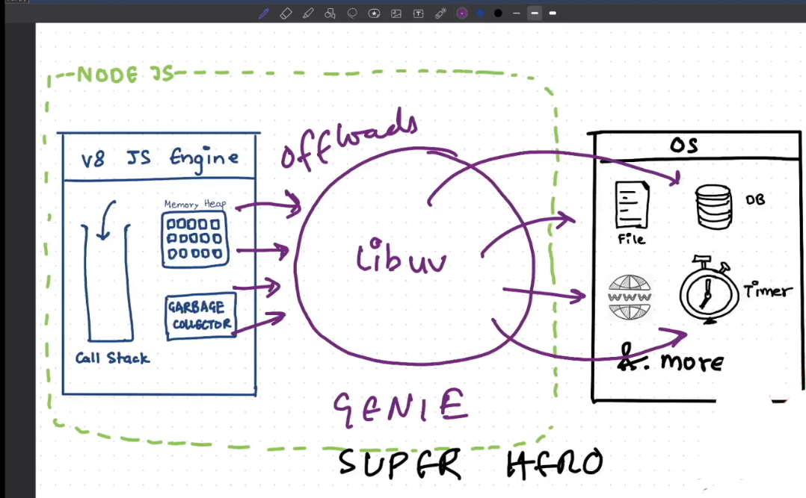
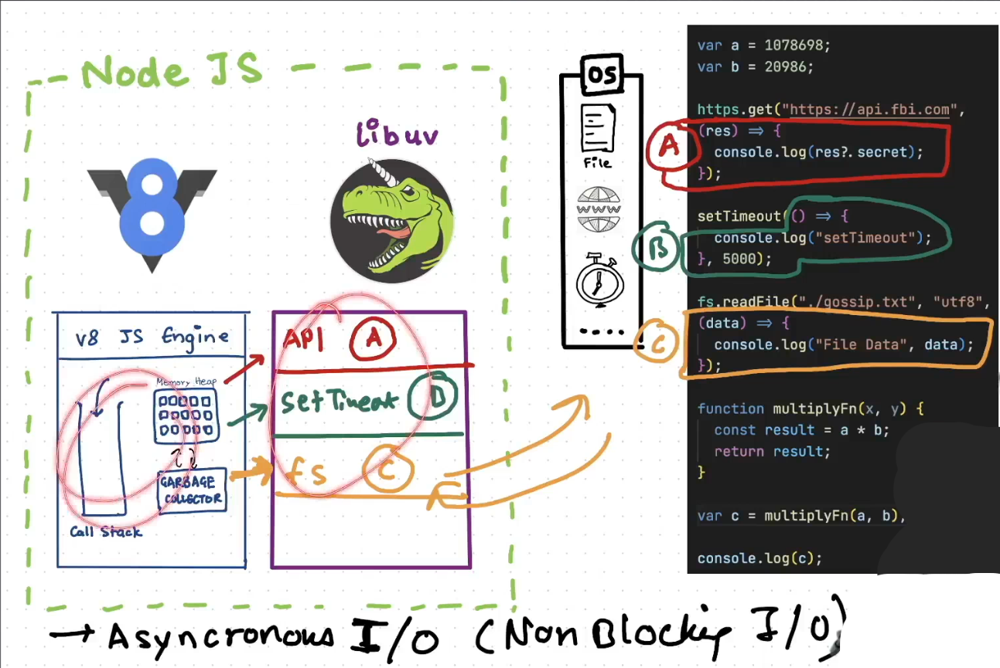

# Libuv async IO

> **Node JS** Event driven architecture, capable of asynchronous I/O
> Javascript is synchronous single threaded language, means line by line execution on single threaded v8

## Cafe

- **Coke** 0 min, **Pizza** 10 min **noodles** 5 min

1. Synchronous way a->b->c->d->e
   A = Coke 0
   B = noddles 5
   C = Pizza 15
   D = Coke 15
   E = Noodles 20

2. Asynchronous way a->d->b->c->e

- Waiting area BCE

  A = Coke 0
  B = noddles 5
  C = Pizza 10
  D = Coke 0
  E = Noodles 10 (second)

> Javascript is synchronous but help of Node JS super power work as async way

## V8 JS engine

1. **Call stack** in which Global execution context other function execution context will push and pop here
2. **Memory Heap** => stores variable and function here
3. **Garbage Collector** => Clear memory for unused variable

### Two operations

1.  Simple calculation offers (sync task)
2.  File read, DB and Http call

- Javascript engine does not wait for anything, it does not have time concept
- Node js gives super power to javascript to interact with OS

## Libuv

1. gives power to JS
2. Multi platform, C library, provides support for async I/O based on event loop
3. Makes async IO task simple for V8(C++)
4. Javascript High-level code to connect OS need C so **libuv** in c, talks with OS
5. Middleware between Javascript and OS
6. It has Thread pool, Event Loop
7. [Reference](https://github.com/nodejs/node/tree/main/deps/uv)
   
   

### Operation

- When Async task comes it registers in Libuv with call back function
- Javascript moves next line and so on and perform sync/simple operation
- After task function of async done in libuv will return, callback function will go in call stack and same for other operation
- Async IO (Non Blocking IO) not blocks main thread (V8 call stack)
